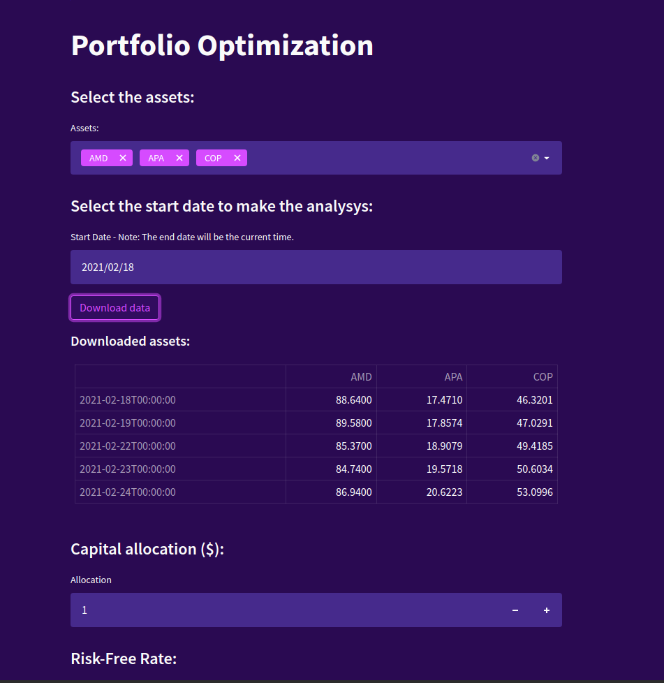
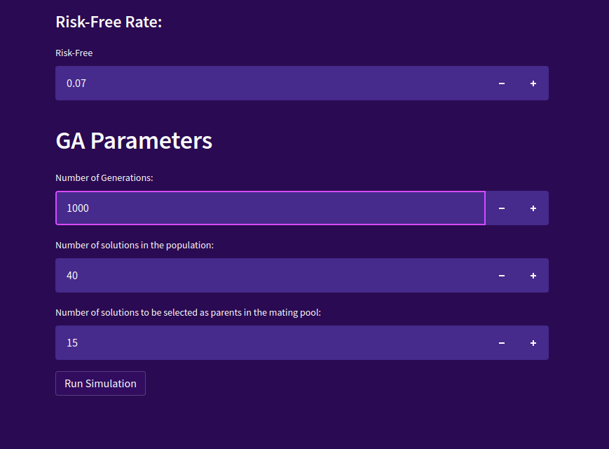

# portfolio_auto_analysis

[](https://codecov.io/gh/WagnoLeaoSergio/portfolio_auto_analysis)
[](https://github.com/WagnoLeaoSergio/portfolio_auto_analysis/actions/workflows/main.yml)

An Web App to make genetic agolrithms experiments with portfolio optimization. 





## Instal from source code

```bash
git clone https://github.com/WagnoLeaoSergio/portfolio_auto_analysis
cd portfolio_auto_analysis
pip3 install -r requirements.txt
```

## Usage

```bash
cd portfolio_auto_analysis
streamlit run dashboard.py
```

## Development

Read the [CONTRIBUTING.md](CONTRIBUTING.md) file.
